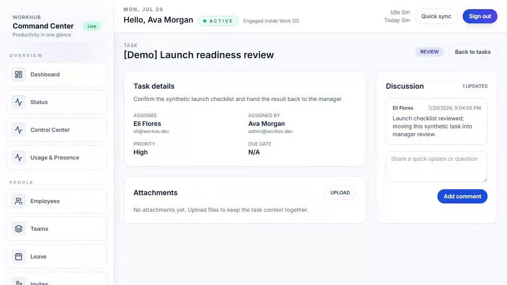

# WorkHub OS

> **Status: tested workplace-operations prototype.** The verified core is the role/project/task workflow with a deterministic in-memory MongoDB demo. Calls, external AI, production monitoring, and hosted credentials remain environment-dependent.

[](docs/demo/demo.webm)

The 5:42 narrated Chromium walkthrough runs the complete synthetic workflow: administrator assignment, employee consent, task review/comment, explicit session stop, and manager verification. [Captions](docs/demo/demo-captions.vtt), [verification metadata](docs/demo/verification/verification.json), and [frame inspection](docs/demo/verification/INSPECTION.md) are included.

[Architecture](docs/ARCHITECTURE.md) · [Test evidence](docs/TEST_REPORT.md) · [UX audit](docs/UX_AUDIT.md) · [Interview guide](docs/INTERVIEW_GUIDE.md)

WorkHub combines role-based projects, tasks, work sessions, attendance, collaboration, calls, reporting, and administration in two applications:

- **Backend:** Express, MongoDB/Mongoose, Socket.IO, JWT access and rotating refresh tokens.
- **Frontend:** Next.js 16, React 18, Tailwind CSS, Zustand, and Axios.

## Verified workflow

An administrator or project manager creates a bounded project and assigns a project member. The employee sees only assigned work, updates task status, and starts a work session. The manager verifies the same persisted state. Database-backed integration tests reject cross-project reads, foreign-manager updates, and employee reassignment attempts.

## Quick start

Requires Node.js 22 and PowerShell on Windows.

```powershell
npm ci --prefix backend
npm ci --prefix frontend
powershell -ExecutionPolicy Bypass -File scripts/run-demo.ps1
```

The script starts both applications with an ephemeral database, seeds fictional users, waits for both health checks, and runs the deterministic workflow verifier. It does not open a browser or call an external provider.

For manual development, run `npm run dev` in `backend` and `frontend`. Local frontend defaults point to `http://127.0.0.1:5000`; hosted environments must configure their API and Socket.IO URLs explicitly.

## Configuration

Copy the example files and replace placeholders locally. Important backend values include `MONGO_URI`, `JWT_SECRET`, `CLIENT_URL`, access/refresh-token lifetimes, and optional `OPENAI_API_KEY`. Public registration and bootstrap-admin behavior are disabled unless explicitly enabled.

WebRTC calls require deployment-specific TURN settings:

```dotenv
NEXT_PUBLIC_TURN_URL=turn:turn.example.com:3478
NEXT_PUBLIC_TURN_USER=<turn-user>
NEXT_PUBLIC_TURN_PASS=<turn-password>
```

## Verification

```bash
npm test --prefix backend
npm run lint --prefix frontend
npm run build --prefix frontend
npm audit --prefix backend
npm audit --prefix frontend
node scripts/check-markdown-links.mjs
```

The backend suite contains five CORS tests and two MongoDB-backed authenticated workflow tests. See [the current test report](docs/TEST_REPORT.md).

The browser evidence includes a fast 14-milestone desktop workflow and a 390×844 responsive audit covering navigation, keyboard focus, and reduced motion.

## Honest boundaries

- The default demo database and accounts are synthetic and reset on restart.
- Tokens currently live in browser storage; production use needs a stricter session and XSS threat model.
- WebRTC requires user permission and deployment-specific TURN/STUN configuration.
- Provider-backed summaries require an explicitly configured key and are not part of the deterministic demo.
- A previously exposed provider credential and reusable JWT must be rotated, revoked, and followed by deployment-log review before a complete production-security claim.

## Documentation

- [Architecture](docs/ARCHITECTURE.md)
- [Development](docs/DEVELOPMENT.md)
- [Project report](docs/PROJECT_REPORT.md)
- [v1.1.0 release notes](docs/RELEASE_NOTES_v1.1.0.md)
- [UX and accessibility audit](docs/UX_AUDIT.md)
- [Troubleshooting](docs/TROUBLESHOOTING.md)
- [Security policy](SECURITY.md)
- [Deployment boundary](DEPLOYMENT.md)

No real employee monitoring, production organization, or external provider success is claimed.
