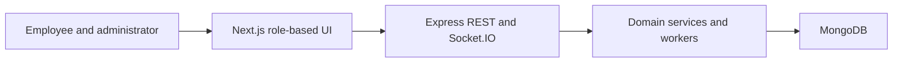

# WorkHub OS architecture

Full-stack workplace operations system covering tasks, attendance, permissions, collaboration, documents, calls, reports, and administration.

## System view

## Component boundaries

- **Employee and administrator:** initiates the primary workflow.
- **Next.js role-based UI:** owns one stage of the request or interaction flow.
- **Express REST and Socket.IO:** owns one stage of the request or interaction flow.
- **Domain services and workers:** owns one stage of the request or interaction flow.
- **MongoDB:** provides the terminal integration or persistence boundary.

## Runtime and trust boundaries

Backend validation requires a MongoDB instance and environment configuration; dependency installation warns that Multer 1.x should be upgraded. Inputs crossing a network, filesystem, provider, or database boundary should be validated and logged without sensitive values. Optional integrations must fail clearly rather than being presented as successful.

## Technology

Next.js/TypeScript, Express/Node.js, MongoDB/Mongoose, Socket.IO, Zustand.

